# Database schema: simple version for drawing by hand

A simplified copy of [database-schema.md](database-schema.md) that is easy to draw in a
notebook. It shows the important tables and columns only. For every column and detail, use
the full version.

## How to read and draw it

```text
+-----------+           +-----------+
| Sale      |1---------N| SaleItem  |     One Sale has many SaleItems.
+-----------+           +-----------+     Each SaleItem stores the id of its Sale (FK saleId).
| PK id     |           | PK id     |
|    total  |           | FK saleId |
+-----------+           +-----------+
```

- **Box:** table name on top, then its columns.
- **PK** (primary key): the table's own unique id.
- **FK** (foreign key): the id of a row in another table. `FK productId` points to `Product`.
  When the other table isn't drawn nearby, its name is in brackets, e.g. `FK userId (User)`.
- **1 ---- N:** one row on the `1` side has many rows on the `N` side. The FK is always
  in the table on the `N` side.
- **Tips:** the whole-database diagram (section 1) needs a full page, turned sideways. The
  smaller diagrams after it each fit on half a page. Draw the boxes first, then the lines,
  then write `1` and `N` at the ends. Use a ruler for straight lines.

**Left out to keep it simple:**
- `organizationId`. Almost every table has it, because each shop company (organization)
  has its own data.
- The `createdAt` / `updatedAt` time columns on most tables.
- Login token tables (`RefreshToken`, `SupplierRefreshToken`), the `AuditLog` history
  table, and `TransactionEvent` (the offline POS event log).

---

## 1. The whole database in one diagram

All 28 main tables and every link between them, in one diagram. Each box lists the type,
the column name, the key (`PK`/`FK`/`UK`) and a short note. On GitHub or in VS Code's
preview you can zoom and pan it.

- Line ends: a single bar `|` means "one", a crow's foot means "many", and a circle
  means "zero is allowed". So `Sale ||--o{ SaleItem` reads: one sale has zero or more
  sale items.
- `StockTransfer` has two links to `Location`, labelled **from** and **to**.

```mermaid
erDiagram
    User {
        string id PK
        string name
        string email UK
        UserRole role
    }
    Location {
        string id PK
        string name
        string code
        LocationType type "STORE or WAREHOUSE"
    }
    PostTerminal {
        string id PK
        string storeId FK "Location"
        string terminalCode
    }
    Category {
        string id PK
        string parentId FK "Category, null"
        string name
    }
    Brand {
        string id PK
        string name
    }
    Product {
        string id PK
        string categoryId FK "null"
        string brandId FK "null"
        string sku
        string name
        decimal costPrice
        decimal sellingPrice
    }
    ProductVariant {
        string id PK
        string productId FK
        string sku
        string barcode UK "null"
    }
    Supplier {
        string id PK
        string name
        string phone "null"
        string email "null"
    }
    PurchaseOrder {
        string id PK
        string supplierId FK
        string locationId FK
        string poNumber UK
        PurchaseOrderStatus status
        decimal totalAmount
    }
    PurchaseOrderItem {
        string id PK
        string purchaseOrderId FK
        string productId FK
        int quantity
        decimal unitCost
    }
    GoodsReceipt {
        string id PK
        string purchaseOrderId FK
        string locationId FK
        string receiptNumber UK
    }
    GoodsReceiptItem {
        string id PK
        string goodsReceiptId FK
        string purchaseOrderItemId FK
        string productId FK
        int quantity
    }
    Sale {
        string id PK
        string storeId FK "Location"
        string terminalId FK "null"
        string transactionNumber UK
        decimal total
        SaleStatus status
    }
    SaleItem {
        string id PK
        string saleId FK
        string productId FK
        int quantity
        decimal unitPrice
    }
    Payment {
        string id PK
        string saleId FK
        PaymentMethod method
        decimal amount
    }
    SaleReturn {
        string id PK
        string saleId FK "null"
        string storeId FK "Location"
        string returnNumber UK
        SaleReturnStatus status
    }
    SaleReturnItem {
        string id PK
        string returnId FK
        string saleItemId FK "null"
        string productId FK
        int quantity
    }
    Inventory {
        string id PK
        string productId FK
        string locationId FK
        int quantity "stock on hand"
    }
    InventoryMovement {
        string id PK
        string productId FK
        string locationId FK
        MovementType type
        int quantity "+ in, - out"
        string referenceType "source document"
        string referenceId
    }
    StockTransfer {
        string id PK
        string sourceLocationId FK "from"
        string destinationLocationId FK "to"
        string transferNumber UK
        TransferStatus status
    }
    StockTransferItem {
        string id PK
        string transferId FK
        string productId FK
        int quantity
    }
    StockAdjustment {
        string id PK
        string locationId FK
        string createdById FK "User, null"
        AdjustmentReason reason
    }
    StockAdjustmentItem {
        string id PK
        string adjustmentId FK
        string productId FK
        int quantity
    }
    SupplierUser {
        string id PK
        string supplierId FK "null"
        string name
        string email UK
    }
    SupplierUpload {
        string id PK
        string supplierUserId FK
        string locationId FK "null"
        string originalName
        SupplierUploadStatus status
        int rowCount
    }
    SupplierUploadItem {
        string id PK
        string uploadId FK
        string stockedLocationId FK "null"
        string sku
        int orderQty
        decimal unitPriceBdt
        SupplierItemEtlStatus etlStatus
    }
    SupplierNotification {
        string id PK
        string supplierUserId FK
        string uploadId FK
        SupplierNotificationType type
        string message
        datetime readAt "null"
    }
    VendorNotification {
        string id PK
        string userId FK "staff"
        string uploadId FK
        VendorNotificationType type
        string message
        datetime readAt "null"
    }

    Location ||--o{ PostTerminal : "hosts"
    Category |o--o{ Category : "parent"
    Category |o--o{ Product : "classifies"
    Brand |o--o{ Product : "brands"
    Product ||--o{ ProductVariant : "has"
    Supplier ||--o{ PurchaseOrder : "supplies"
    Location |o--o{ PurchaseOrder : "delivers to"
    PurchaseOrder ||--o{ PurchaseOrderItem : "contains"
    Product ||--o{ PurchaseOrderItem : "ordered as"
    PurchaseOrder ||--o{ GoodsReceipt : "received as"
    Location ||--o{ GoodsReceipt : "received at"
    GoodsReceipt ||--o{ GoodsReceiptItem : "contains"
    PurchaseOrderItem ||--o{ GoodsReceiptItem : "fulfilled by"
    Product ||--o{ GoodsReceiptItem : "received as"
    Location ||--o{ Sale : "sold at"
    PostTerminal |o--o{ Sale : "rang up"
    Sale ||--o{ SaleItem : "contains"
    Product ||--o{ SaleItem : "sold as"
    Sale ||--o{ Payment : "paid by"
    Location ||--o{ SaleReturn : "returned at"
    Sale |o--o{ SaleReturn : "returned via"
    SaleReturn ||--o{ SaleReturnItem : "contains"
    SaleItem |o--o{ SaleReturnItem : "returned as"
    Product ||--o{ SaleReturnItem : "returned as"
    Product ||--o{ Inventory : "stocked as"
    Location ||--o{ Inventory : "holds"
    Product ||--o{ InventoryMovement : "moved"
    Location ||--o{ InventoryMovement : "at"
    Location ||--o{ StockTransfer : "from"
    Location ||--o{ StockTransfer : "to"
    StockTransfer ||--o{ StockTransferItem : "contains"
    Product ||--o{ StockTransferItem : "moved as"
    Location ||--o{ StockAdjustment : "adjusted at"
    User |o--o{ StockAdjustment : "created"
    StockAdjustment ||--o{ StockAdjustmentItem : "contains"
    Product ||--o{ StockAdjustmentItem : "adjusted as"
    Supplier |o--o{ SupplierUser : "login for"
    SupplierUser ||--o{ SupplierUpload : "uploads"
    Location |o--o{ SupplierUpload : "last stocked to"
    SupplierUpload ||--o{ SupplierUploadItem : "contains"
    Location |o--o{ SupplierUploadItem : "stocked to"
    SupplierUser ||--o{ SupplierNotification : "receives"
    SupplierUpload ||--o{ SupplierNotification : "about"
    SupplierUpload ||--o{ VendorNotification : "about"
    User ||--o{ VendorNotification : "receives"
```



<details>
<summary>Plain-text version (easier to copy with a ruler)</summary>

The same tables and links, drawn with plain characters. `Product` and `Location` are two
tall bars because almost every table links to them; a line into a bar is a link to that
table. The line around the left side is `User` 1 --- N `StockAdjustment`.

```text
                                                                       +--------------------+     +----------+
                                                                       | SupplierUploadItem |N---1| Location |
                                                                       +--------------------+     |          |
                                                                                  |N              |          |
                                                                                  |1              |          |
  1+----------------+                     +----------------------+     +--------------------+     |          |
 +-| User           |1-------------------N| VendorNotification   |N---1|                    |N---1|          |
 | +----------------+                     +----------------------+     |                    |     |          |
 |                                                                     | SupplierUpload     |     |          |
 |                                        +----------------------+     |                    |     |          |
 |                                        | SupplierNotification |N---1|                    |     |          |
 |                                        +----------------------+     +--------------------+     |          |
 |                                              |N                                |N              |          |
 |                                              |                                 |               |          |
 |                                              |                                 |1              |          |
 |                                              |                    1 +--------------------+     |          |
 |                                              +----------------------| SupplierUser       |     |          |
 |       parent                                                        +--------------------+     |          |
 |     +-------+                                                                  |N              |          |
 |     |1      |N         +---------+                                             |1              |          |
 | +----------------+     | Product |                                  +--------------------+     |          |
 | | Category       |1---N|         |                                  | Supplier           |     |          |
 | +----------------+     |         |                                  +--------------------+     |          |
 |                        |         |                                             |1              |          |
 |                        |         |                                             |N              |          |
 | +----------------+     |         |     +----------------------+     +--------------------+     |          |
 | | Brand          |1---N|         |1---N| PurchaseOrderItem    |N---1| PurchaseOrder      |N---1|          |
 | +----------------+     |         |     +----------------------+     +--------------------+     |          |
 |                        |         |                 |1                          |1              |          |
 |                        |         |                 |N                          |N              |          |
 | +----------------+     |         |     +----------------------+     +--------------------+     |          |
 | | ProductVariant |N---1|         |1---N| GoodsReceiptItem     |N---1| GoodsReceipt       |N---1|          |
 | +----------------+     |         |     +----------------------+     +--------------------+     |          |
 |                        |         |                                                             |          |
 |                        |         |                                                             |          |
 |                        |         |                                  +--------------------+     |          |
 |                        |         |                                  | PostTerminal       |N---1|          |
 |                        |         |                                  +--------------------+     | Location |
 |                        |         |                                             |1              |          |
 |                        |         |                                             |N              |          |
 |                        |         |     +----------------------+     +--------------------+     |          |
 |                        |         |     | Payment              |N---1|                    |N---1|          |
 |                        |         |     +----------------------+     |                    |     |          |
 |                        |         |                                  | Sale               |     |          |
 |                        |         |     +----------------------+     |                    |     |          |
 |                        |         |1---N| SaleItem             |N---1|                    |     |          |
 |                        | Product |     +----------------------+     +--------------------+     |          |
 |                        |         |                 |1                          |1              |          |
 |                        |         |                 |                           |               |          |
 |                        |         |                 |N                          |N              |          |
 |                        |         |     +----------------------+     +--------------------+     |          |
 |                        |         |1---N| SaleReturnItem       |N---1| SaleReturn         |N---1|          |
 |                        |         |     +----------------------+     +--------------------+     |          |
 |                        |         |                                                             |          |
 |                        |         |                                                             |          |
 |                        |         |     +-------------------------------------------------+     |          |
 |                        |         |1---N| Inventory                                       |N---1|          |
 |                        |         |     +-------------------------------------------------+     |          |
 |                        |         |                                                             |          |
 |                        |         |     +-------------------------------------------------+     |          |
 |                        |         |1---N| InventoryMovement                               |N---1|          |
 |                        |         |     +-------------------------------------------------+     |          |
 |                        |         |                                                             |          |
 |                        |         |                                                             |          |
 |                        |         |                                  +--------------------+     |          |
 |                        |         |     +----------------------+     |               from |N---1|          |
 |                        |         |1---N| StockTransferItem    |N---1| StockTransfer      |     |          |
 |                        |         |     +----------------------+     |                 to |N---1|          |
 |                        |         |                                  +--------------------+     |          |
 |                        |         |                                                             |          |
 |                        |         |                                                             |          |
 |                        |         |     +----------------------+     +--------------------+     |          |
 |                        |         |1---N| StockAdjustmentItem  |N---1| StockAdjustment    |N---1|          |
 |                        | Product |     +----------------------+     +--------------------+     | Location |
 |                        +---------+                                             |N              +----------+
 |                                                                                |
 |                                                                                |
 +--------------------------------------------------------------------------------+
```

</details>

How to read it, top to bottom:

- **Supplier portal:** a `Supplier` has login accounts (`SupplierUser`), which upload files
  (`SupplierUpload`, one `SupplierUploadItem` per row). Notifications go to the supplier
  (`SupplierNotification`) and to staff (`VendorNotification`, one per `User`).
- **Catalog:** `Category`, `Brand` and `ProductVariant` hang off `Product`. A category can
  be inside another category (`parent`).
- **Buying:** a `PurchaseOrder` to a `Supplier` lists products (`PurchaseOrderItem`). A
  delivery is a `GoodsReceipt` with its `GoodsReceiptItem`s.
- **Selling:** a `Sale` at a till (`PostTerminal`) lists products (`SaleItem`) and is paid
  with `Payment`s. A `SaleReturn` gives products back (`SaleReturnItem`).
- **Stock:** `Inventory` is how many of a product a location has now. `InventoryMovement`
  is the history of every change.
- **Moving and fixing stock:** `StockTransfer` moves stock between locations.
  `StockAdjustment` corrects it.

---

## The same tables part by part, with columns

Draw these if you also need the columns. Each fits on half a page.

## 2. People and places

```text
+--------------------------+      +--------------------------+      +--------------------------+
| User                     |N----1| Organization             |1----N| Location                 |
+--------------------------+      +--------------------------+      +--------------------------+
| PK id                    |      | PK id                    |      | PK id                    |
| FK organizationId        |      |    name                  |      | FK organizationId        |
|    name                  |      |    code (unique)         |      |    name                  |
|    email (unique)        |      +--------------------------+      |    code                  |
|    role                  |                                        |    type                  |
+--------------------------+                                        +--------------------------+
                                                                                  |1
                                                                                  |
                                                                                  |
                                                                                  |N
                                                                    +--------------------------+
                                                                    | PostTerminal             |
                                                                    +--------------------------+
                                                                    | PK id                    |
                                                                    | FK storeId (Location)    |
                                                                    |    terminalCode          |
                                                                    +--------------------------+
```

`Location.type` is `STORE` or `WAREHOUSE`. A `PostTerminal` is a till in a store.

---

## 3. Products (catalog)

```text
+--------------------------+      +--------------------------+      +--------------------------+
| Category                 |1----N| Product                  |N----1| Brand                    |
+--------------------------+      +--------------------------+      +--------------------------+
| PK id                    |      | PK id                    |      | PK id                    |
| FK parentId (Category)   |      | FK categoryId            |      |    name                  |
|    name                  |      | FK brandId               |      +--------------------------+
+--------------------------+      |    sku                   |
                                  |    name                  |
                                  |    costPrice             |
                                  |    sellingPrice          |
                                  +--------------------------+
                                                |1
                                                |
                                                |
                                                |N
                                  +--------------------------+
                                  | ProductVariant           |
                                  +--------------------------+
                                  | PK id                    |
                                  | FK productId             |
                                  |    sku                   |
                                  |    barcode               |
                                  |    size, color           |
                                  +--------------------------+
```

A category can sit inside another category (`parentId`). A variant is one size or colour of
a product, with its own SKU and barcode.

---

## 4. Buying from suppliers

```text
+--------------------------+      +--------------------------+      +--------------------------+
| Supplier                 |1----N| PurchaseOrder            |1----N| PurchaseOrderItem        |
+--------------------------+      +--------------------------+      +--------------------------+
| PK id                    |      | PK id                    |      | PK id                    |
|    name                  |      | FK supplierId            |      | FK purchaseOrderId       |
|    phone, email          |      | FK locationId            |      | FK productId             |
+--------------------------+      |    poNumber              |      |    quantity              |
                                  |    status                |      |    unitCost              |
                                  |    totalAmount           |      +--------------------------+
                                  +--------------------------+                    |1
                                                |1                                |
                                                |                                 |
                                                |                                 |
                                                |N                                |N
                                  +--------------------------+      +--------------------------+
                                  | GoodsReceipt             |1----N| GoodsReceiptItem         |
                                  +--------------------------+      +--------------------------+
                                  | PK id                    |      | PK id                    |
                                  | FK purchaseOrderId       |      | FK goodsReceiptId        |
                                  | FK locationId            |      | FK purchaseOrderItemId   |
                                  |    receiptNumber         |      | FK productId             |
                                  +--------------------------+      |    quantity              |
                                                                    +--------------------------+
```

`PurchaseOrder.locationId` and `GoodsReceipt.locationId` point to `Location`. A
`GoodsReceipt` records a delivery that arrived for an order.

---

## 5. Selling and returns

```text
+--------------------------+      +--------------------------+      +--------------------------+
| Payment                  |N----1| Sale                     |1----N| SaleItem                 |
+--------------------------+      +--------------------------+      +--------------------------+
| PK id                    |      | PK id                    |      | PK id                    |
| FK saleId                |      | FK storeId (Location)    |      | FK saleId                |
|    method                |      | FK terminalId            |      | FK productId             |
|    amount                |      |    transactionNumber     |      |    quantity              |
+--------------------------+      |    total                 |      |    unitPrice             |
                                  |    status                |      +--------------------------+
                                  +--------------------------+                    |1
                                                |1                                |
                                                |                                 |
                                                |                                 |
                                                |N                                |N
                                  +--------------------------+      +--------------------------+
                                  | SaleReturn               |1----N| SaleReturnItem           |
                                  +--------------------------+      +--------------------------+
                                  | PK id                    |      | PK id                    |
                                  | FK saleId (optional)     |      | FK returnId              |
                                  | FK storeId (Location)    |      | FK saleItemId (optional) |
                                  |    returnNumber          |      | FK productId             |
                                  |    status                |      |    quantity              |
                                  +--------------------------+      +--------------------------+
```

A return can be linked to the original sale, but it doesn't have to be (`optional`).

---

## 6. Stock

```text
                                  +--------------------------+
                                  | Product                  |
                                  +--------------------------+
                                             |1    |1
              +------------------------------+     +------------------------------+
              |                                                                   |
              |N                                                                  |N
+--------------------------+                                        +--------------------------+
| Inventory                |                                        | InventoryMovement        |
+--------------------------+                                        +--------------------------+
| PK id                    |                                        | PK id                    |
| FK productId             |                                        | FK productId             |
| FK locationId            |                                        | FK locationId            |
|    quantity              |                                        |    type                  |
+--------------------------+                                        |    quantity (+ or -)     |
              |N                                                    |    referenceType         |
              |                                                     |    referenceId           |
              |                                                     +--------------------------+
              |                                                                   |N
              |                                                                   |
              |                                                                   |
              +------------------------------+     +------------------------------+
                                             |1    |1
                                  +--------------------------+
                                  | Location                 |
                                  +--------------------------+
```

- `Inventory` is the current count of a product in a location.
- `InventoryMovement` is the history: every change (sale, purchase, transfer...) adds a row,
  with `quantity` positive for stock in and negative for stock out. `referenceType` and
  `referenceId` say which document caused it.

### Moving and correcting stock

```text
+--------------------------+      +--------------------------+
| StockTransfer            |1----N| StockTransferItem        |
+--------------------------+      +--------------------------+
| PK id                    |      | PK id                    |
| FK sourceLocationId      |      | FK transferId            |
| FK destinationLocationId |      | FK productId             |
|    transferNumber        |      |    quantity              |
|    status                |      +--------------------------+
+--------------------------+


+--------------------------+      +--------------------------+
| StockAdjustment          |1----N| StockAdjustmentItem      |
+--------------------------+      +--------------------------+
| PK id                    |      | PK id                    |
| FK locationId            |      | FK adjustmentId          |
| FK createdById (User)    |      | FK productId             |
|    reason                |      |    quantity              |
+--------------------------+      +--------------------------+
```

A transfer moves stock from one location to another. An adjustment corrects stock, for
example after damage or a stock count.

---

## 7. Supplier portal

```text
+--------------------------+
| Supplier                 |
+--------------------------+
| PK id                    |
|    name                  |
+--------------------------+
              |1
              |
              |
              |N
+--------------------------+      +--------------------------+      +--------------------------+
| SupplierUser             |1----N| SupplierUpload           |1----N| SupplierUploadItem       |
+--------------------------+      +--------------------------+      +--------------------------+
| PK id                    |      | PK id                    |      | PK id                    |
| FK supplierId            |      | FK supplierUserId        |      | FK uploadId              |
|    name                  |      | FK locationId            |      | FK stockedLocationId     |
|    email (unique)        |      |    originalName          |      |    sku                   |
+--------------------------+      |    status                |      |    orderQty              |
              |1                  |    rowCount              |      |    unitPriceBdt          |
              |                   +--------------------------+      |    etlStatus             |
              |                                 |1                  +--------------------------+
              |                                 |
              |                                 |
              |N                                |N
+--------------------------+      +--------------------------+
| SupplierNotification     |      | VendorNotification       |
+--------------------------+      +--------------------------+
| PK id                    |      | PK id                    |
| FK supplierUserId        |      | FK uploadId              |
| FK uploadId              |      | FK userId (User)         |
|    type                  |      |    type                  |
|    message               |      |    message               |
|    readAt                |      |    readAt                |
+--------------------------+      +--------------------------+
```

- A supplier logs in as a `SupplierUser` and uploads a CSV file (`SupplierUpload`). Each row
  of the file becomes a `SupplierUploadItem`.
- `etlStatus` tracks each row: `NEW` → `GOOD` → `STOCKED` (added to stock), or
  `NEW` → `INCOMPLETE` → `RETURNED` (sent back to the supplier to fix).
- `SupplierNotification` messages go to the supplier. `VendorNotification` messages go to
  staff (`User`) when a supplier sends something for review.
