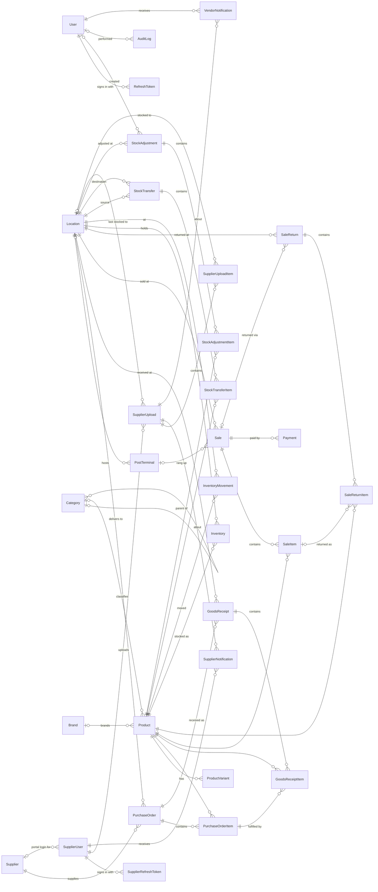
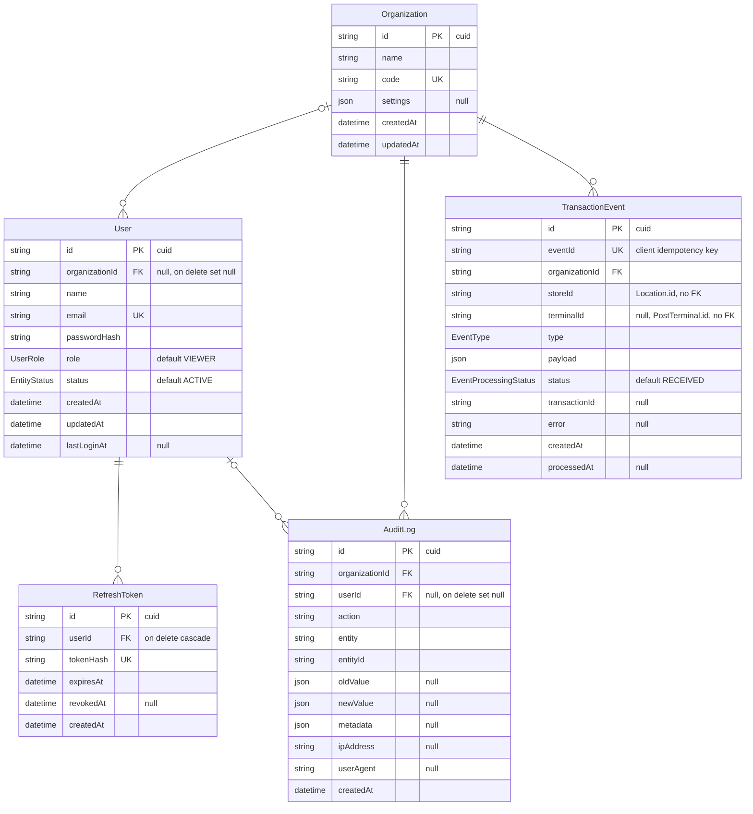
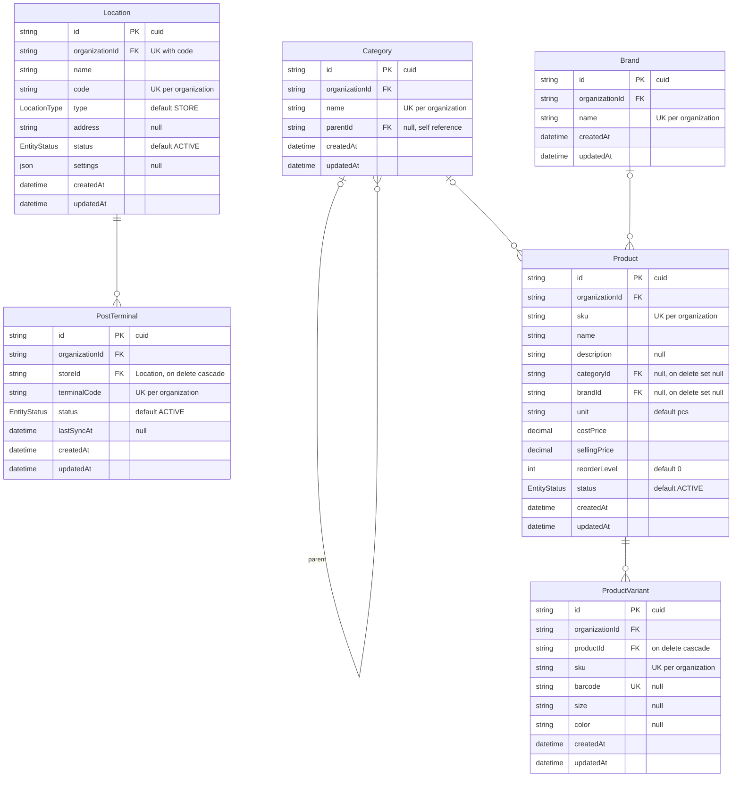
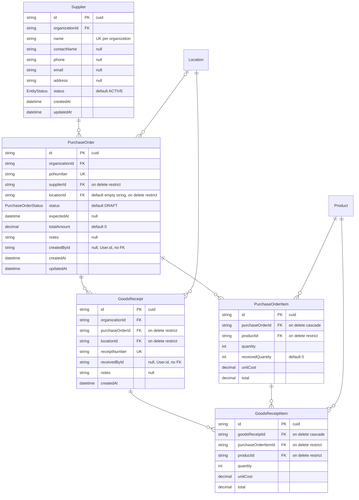
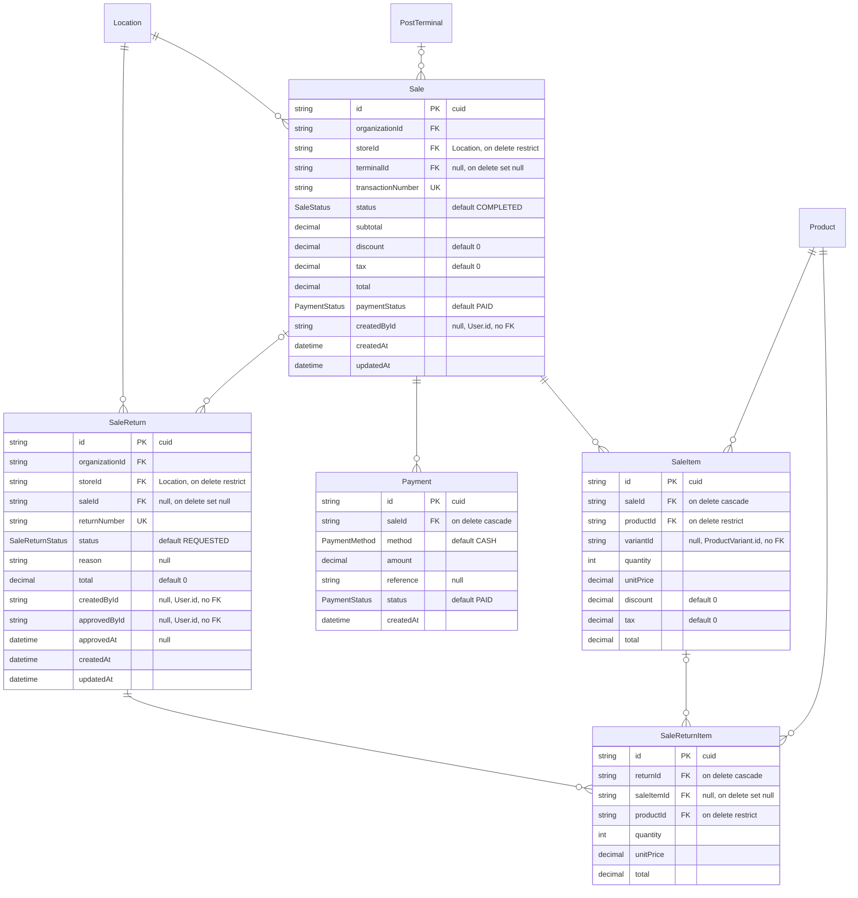
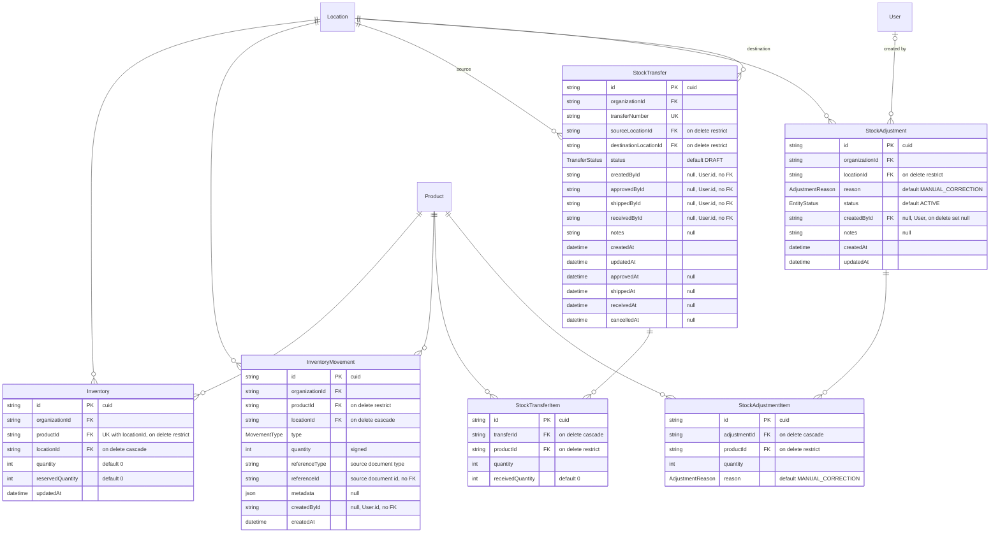
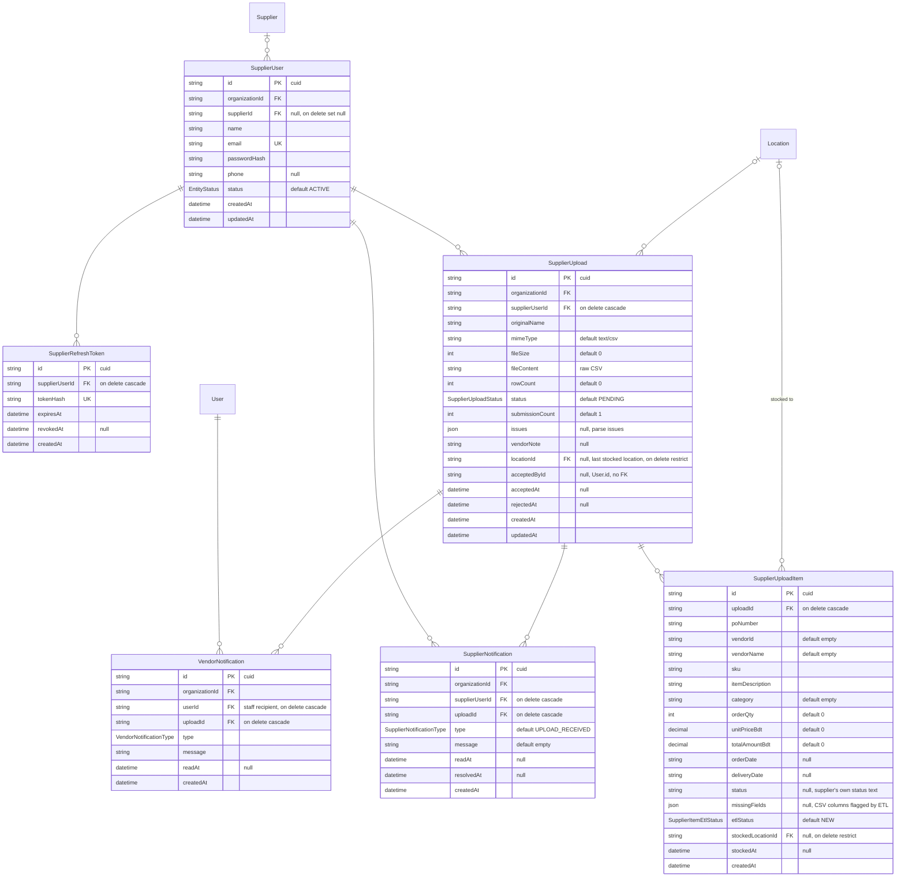
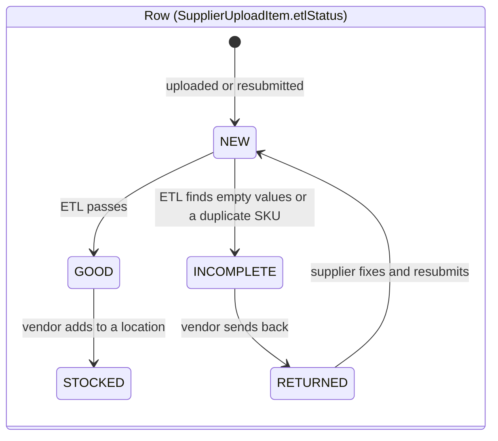

# Database schema

The source of truth is [`backend/packages/database/prisma/schema.prisma`](../backend/packages/database/prisma/schema.prisma)
(PostgreSQL). This document diagrams it. Update it whenever the schema changes.

The diagrams are Mermaid, which renders on GitHub and in most Markdown viewers. For a
simplified version that is easy to draw by hand, see
[database-schema-simple.md](database-schema-simple.md).

**Legend:** `PK` primary key, `FK` foreign key (enforced by the database), `UK` unique.
Cardinality: `||--o{` one to zero-or-many, `|o--o{` zero-or-one to zero-or-many (the
foreign key is nullable).

- [1. ER diagram](#1-er-diagram)
- [2. Schema diagrams](#2-schema-diagrams)
- [3. Enums](#3-enums)
- [4. References without a foreign key](#4-references-without-a-foreign-key)

---

## 1. ER diagram

### 1.1 Tenancy

Every business table belongs to one `Organization`. The exceptions are the token tables and
the child line-item tables (`*Item`, `Payment`), which belong to it through their parent.
Deleting an organization cascades to all of them except `User`: `User.organizationId` is
nullable and set to null instead, so a user (such as a `SUPER_ADMIN`) can exist without an
organization.

```mermaid
erDiagram
    direction LR
    Organization |o--o{ User : "has staff"
    Organization ||--o{ Location : ""
    Organization ||--o{ PostTerminal : ""
    Organization ||--o{ Category : ""
    Organization ||--o{ Brand : ""
    Organization ||--o{ Product : ""
    Organization ||--o{ ProductVariant : ""
    Organization ||--o{ Supplier : ""
    Organization ||--o{ PurchaseOrder : ""
    Organization ||--o{ GoodsReceipt : ""
    Organization ||--o{ Sale : ""
    Organization ||--o{ SaleReturn : ""
    Organization ||--o{ Inventory : ""
    Organization ||--o{ InventoryMovement : ""
    Organization ||--o{ StockTransfer : ""
    Organization ||--o{ StockAdjustment : ""
    Organization ||--o{ TransactionEvent : ""
    Organization ||--o{ AuditLog : ""
    Organization ||--o{ SupplierUser : ""
    Organization ||--o{ SupplierUpload : ""
    Organization ||--o{ SupplierNotification : ""
    Organization ||--o{ VendorNotification : ""
```

### 1.2 Relationships between business tables

All foreign keys except the `Organization` ones above.

---

## 2. Schema diagrams

Every column, grouped by domain. Nullable columns are marked `null` in the comment, and
money columns are `decimal(12,2)`. Tables from another domain appear as bare boxes where
a foreign key points to them. `Organization` is left out after 2.1; see [1.1](#11-tenancy).

### 2.1 Tenancy and identity

### 2.2 Locations and catalog

### 2.3 Purchasing

### 2.4 Sales, payments and returns

### 2.5 Inventory, transfers and adjustments

`Inventory` is the current balance per product and location. `InventoryMovement` is the
append-only ledger behind it. Every stock change writes a movement whose `referenceType`
and `referenceId` point to the document that caused it (a sale, a transfer, a supplier
upload, and so on).

### 2.6 Supplier portal

Suppliers sign in separately from staff (`SupplierUser`, not `User`). They upload CSV files
(`SupplierUpload`), one `SupplierUploadItem` per row. The vendor runs ETL over the rows and
stocks the good ones into a location. Notifications go both ways: `SupplierNotification`
to the supplier, and `VendorNotification` to each staff reviewer.

#### Supplier upload lifecycle

Upload status is derived from its rows' `etlStatus`, except `REJECTED`, which the vendor
sets for the whole file.

| Upload status | When |
|---|---|
| `PENDING` | Any row is `NEW`, `GOOD` or `INCOMPLETE` (the vendor has work to do) |
| `INCOMPLETE` | No vendor work left, and some rows are `RETURNED` (waiting on the supplier) |
| `ACCEPTED` | Every row is `STOCKED` |
| `REJECTED` | Set by the vendor for the whole file, only while no row is `STOCKED` |

---

## 3. Enums

| Enum | Values | Used by |
|---|---|---|
| `UserRole` | `SUPER_ADMIN`, `ORGANIZATION_ADMIN`, `MANAGER`, `STORE_MANAGER`, `INVENTORY_MANAGER`, `CASHIER`, `VIEWER` | `User.role` |
| `LocationType` | `STORE`, `WAREHOUSE` | `Location.type` |
| `EntityStatus` | `ACTIVE`, `INACTIVE`, `DISCONTINUED` | `status` on `User`, `Location`, `PostTerminal`, `Product`, `Supplier`, `StockAdjustment`, `SupplierUser` |
| `SaleStatus` | `COMPLETED`, `CANCELLED`, `REFUNDED` | `Sale.status` |
| `PaymentStatus` | `PENDING`, `PAID`, `PARTIALLY_PAID`, `REFUNDED`, `CANCELLED` | `Sale.paymentStatus`, `Payment.status` |
| `PaymentMethod` | `CASH`, `CARD`, `MOBILE_PAYMENT`, `BANK_TRANSFER`, `CREDIT`, `OTHER` | `Payment.method` |
| `SaleReturnStatus` | `REQUESTED`, `APPROVED`, `REJECTED` | `SaleReturn.status` |
| `TransferStatus` | `DRAFT`, `PENDING`, `APPROVED`, `IN_TRANSIT`, `RECEIVED`, `CANCELLED` | `StockTransfer.status` |
| `AdjustmentReason` | `DAMAGED`, `LOST`, `STOCK_COUNT_VARIANCE`, `FOUND`, `MANUAL_CORRECTION`, `OTHER` | `StockAdjustment.reason`, `StockAdjustmentItem.reason` |
| `PurchaseOrderStatus` | `DRAFT`, `ORDERED`, `PARTIALLY_RECEIVED`, `RECEIVED`, `CANCELLED` | `PurchaseOrder.status` |
| `MovementType` | `PURCHASE`, `SALE`, `RETURN`, `TRANSFER_IN`, `TRANSFER_OUT`, `ADJUSTMENT`, `DAMAGE`, `STOCK_COUNT` | `InventoryMovement.type` |
| `EventType` | `SALE`, `RETURN`, `PURCHASE_RECEIVE`, `TRANSFER_RECEIVE`, `STOCK_ADJUSTMENT`, `STOCK_COUNT` | `TransactionEvent.type` |
| `EventProcessingStatus` | `RECEIVED`, `PROCESSED`, `FAILED`, `DUPLICATE` | `TransactionEvent.status` |
| `SupplierUploadStatus` | `PENDING`, `REJECTED`, `ACCEPTED`, `INCOMPLETE` | `SupplierUpload.status` |
| `SupplierItemEtlStatus` | `NEW`, `GOOD`, `INCOMPLETE`, `RETURNED`, `STOCKED` | `SupplierUploadItem.etlStatus` |
| `SupplierNotificationType` | `UPLOAD_RECEIVED`, `REJECTED`, `ACCEPTED` | `SupplierNotification.type` |
| `VendorNotificationType` | `UPLOAD_SUBMITTED`, `UPLOAD_RESUBMITTED`, `ROWS_RESUBMITTED` | `VendorNotification.type` |

---

## 4. References without a foreign key

These columns hold another table's id, but the database does not enforce it (no foreign
key, no cascade). The diagrams show them as plain columns.

| Column | Points to |
|---|---|
| `PurchaseOrder.createdById` | `User.id` |
| `GoodsReceipt.receivedById` | `User.id` |
| `Sale.createdById` | `User.id` |
| `SaleItem.variantId` | `ProductVariant.id` |
| `SaleReturn.createdById`, `SaleReturn.approvedById` | `User.id` |
| `InventoryMovement.createdById` | `User.id` |
| `InventoryMovement.referenceType` + `referenceId` | The source document, e.g. `SupplierUpload` + its id |
| `StockTransfer.createdById`, `approvedById`, `shippedById`, `receivedById` | `User.id` |
| `TransactionEvent.storeId` | `Location.id` |
| `TransactionEvent.terminalId` | `PostTerminal.id` |
| `TransactionEvent.transactionId` | The `Sale` or other record created from the event |
| `SupplierUpload.acceptedById` | `User.id` |
